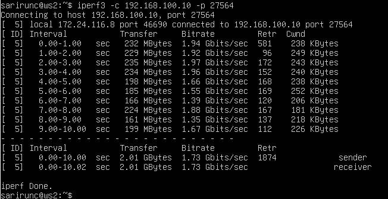
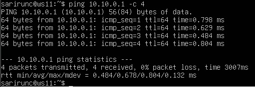
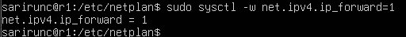
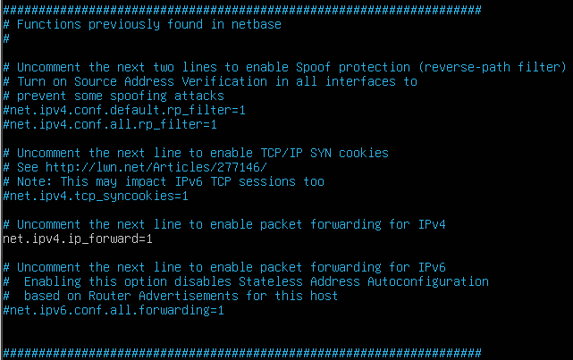
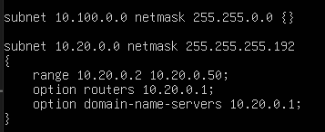
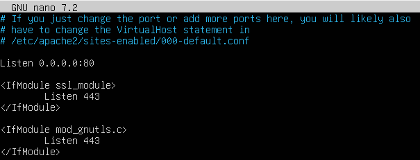

# Сети в Linux
## 1 Инструмент ipcalc
* Подняли виртуальную машину WS1.
### 1.1 Сети и маски
#### 1.1.1 Адрес сети
* Адрес сети 192.167.38.54/13: **255.248.0.0**
#### 1.1.2 Маски
* Маска 255.255.255.0 в префиксном виде: **/24**
* Маски 255.255.255.0 в двоичном виде: **11111111.11111111.11111111.00000000**
* Маска /15 в десятичном виде: **255.254.0.0**
* Маска /15 в двоичном виде: **11111111.11111110.00000000.00000000**
* Маска 11111111.11111111.11111111.11110000 в десятичном виде: **255.255.255.240**
* Маска 11111111.11111111.11111111.11110000 в префиксном виде: **/28**
#### 1.1.3 Минимальный и максимальный хост в сети 12.167.38.4
##### 1) При маске /8:
* Минимальный хост: **12.0.0.0**
* Максимальный хост: **12.255.255.254**
##### 2) При маске 11111111.11111111.00000000.00000000:
* Минимальный хост: **12.167.0.1**
* Максимальный хост: **12.167.255.254**
##### 3) При маске 255.255.254.0:
* Минимальный хост: **12.167.38.1**
* Максимальный хост: **12.167.39.254**
##### 4) При маске /4:
* Минимальный хост: **0.0.0.1**
* Максимальный хост: **15.255.255.254**
### 1.2 localhost
К приложению, работающему на localhost:
* можно обратиться по адресам: **127.0.0.2, 127.1.0.1**
* нельзя обратиться по адресам: **194.34.23.100, 128.0.0.1**
### 1.3 Диапазоны и сегменты сетей
1) Публичные и частные IP адреса
* Публичные: **134.43.0.2, 172.0.2.1, 192.172.0.1, 172.68.0.2, 192.169.168.1**
* Частные: **10.0.0.45,  10.10.10.10, 172.20.250.4, 172.16.255.255, 192.168.4.2**
2) IP-адреса шлюза у сети 10.10.0.0/18:
* Возможны: **10.10.0.2, 10.10.1.255**
* Невозможны: **10.0.0.1, 10.10.10.10, 10.10.100.1**
## 2 Статическая маршрутизация между двумя машинами
1) Подняли две виртуальные машины: ws1 и ws2.
2) С помощью команды ``ip a`` посмотрели существующие сетевые интерфейсы.
* На рисунке 1 показаны сетевые интерфейсы ws1.
##### Рисунок 1 - Сетевые интерфейсы ws1

* На рисунке 2 показаны сетевые интерфейсы ws2.
##### Рисунок 2 - Сетевые интерфейсы ws2

```
Сетевой интерфейс внутренней сети ws1:
- Название: enp0s3
- IPv4 адрес: 192.168.0.3/24
Сетевой интерфейс внутренней сети ws2:
- Название: enp0s3
- IPv4 адрес: 192.168.0.3/24
```
3) Задали ws1 адрес - 192.168.100.10/16
* На рисунке 3 показаны новые сетевые настроки ws1.
##### Рисунок 3 - Вывод etc/netplan/00-installer-config.yaml на ws1


4) Задали ws2 адрес - 172.24.116.8/12
* На рисунке 4 показаны новые сетевые настроки ws2.
##### Рисунок 4 - Вывод etc/netplan/00-installer-config.yaml на ws2


5) Выполнили команду ``netplan apply`` для перезапуска сервиса сети.
В отчёт помести скрин с вызовом и выводом использованной команды.
* На рисунке 5 показано выполнение команды на ws1.
##### Рисунок 5 - Вывод ``netplan apply`` на ws1

* На рисунке 6 показано выполнение команды на ws2.
##### Рисунок 6 - Вывод ``netplan apply`` на ws2

### 2.1 Добавление статического маршрута вручную
1) Добавили статический маршрут на ws1 до ws2 командой ``ip r add``.
##### Рисунок 7 - Создание статического маршрута до ws2


2) Добавили статический маршрут на ws2 до ws1 командой ``ip r add``.
##### Рисунок 8 - Создание статического маршрута до ws1


3) Отправили пинг с ws1 до ws2.
##### Рисунок 9 - Проверка соединения

### 2.2 Добавление статического маршрута с сохранением
1) Перезапустили машины.
2) Добавили статический маршрут от ws1 до ws2 с помощью файла /etc/netplan/00-installer-config.yaml.
##### Рисунок 10 - Настройки сети ws1 из файла


3) Добавили статический маршрут от ws2 до ws1 с помощью файла /etc/netplan/00-installer-config.yaml.
##### Рисунок 11 - Настройки сети ws2 из файла


3) Проверили соединение командой ``ping``.
##### Рисунок 12 - Результат проверки соединения

## 3 Утилита iperf3
### 3.1 Скорость соединения
* 8 Mbps = 1 MB/s
* 100 MB/s = 800000 Kbps 
* 1 Gbps = 1000 Mbps.
### 3.2 Утилита iperf3
1) Запустили iperf3 на ws1(server)
##### Рисунок 13 - Вызов команды на ws1


2) Запустили iperf3 на ws2(client)
##### Рисунок 14 - Вызов команды на ws2


3) Проверили скорость соединения
##### Рисунок 15 - Результат проверки скорости

## 4 Сетевой экран
### 4.1 Утилита iptables
1) Создали файл /etc/firewall.sh, имитирующий файрвол, на ws1 и ws2
2) Добавили в файл подряд следующие правила:
* Открыть доступ для порта 22 (ssh)
* Открыть доступ для порта 80 (http)
* Запретить echo reply (машина не должна «пинговаться»).
* Разрешить echo reply (машина должна «пинговаться»).
3) На ws1 применили стратегию, когда в начале пишется запрещающее правило, а в конце пишется разрешающее правило (это касается правил icmp).
##### Рисунок 16 - Содержание файла firewall.sh на ws1


* На ws2 применили стратегию, когда в начале пишется разрешающее правило, а в конце пишется запрещающее правило (это касается правил icmp).
##### Рисунок 17 - Содержание файла firewall.sh на ws2


4) Выдали права на запуск файлов на каждой машине командой ``chmod +x /etc/firewall.sh``
5) Запустии файл на ws1
##### Рисунок 18 - Запуск файла на ws1


6) Запустии файл на ws2
##### Рисунок 19 - Запуск файла на ws2


```
- В iptables правила обрабатываются в порядке их добавления, и первое соответствующее правило определяет, что произойдет с пакетом.
- Если пакет соответствует правилу с действием ACCEPT, он разрешается, и дальнейшая проверка не происходит. Пакет будет передан дальше по сети.
- Если пакет соответствует правилу с действием REJECT, он отклоняется, и отправляется ответ (ICMP сообщение) о том, что пакет был отклонен. Дальнейшая проверка не происходит.

Таким образом, в первом случае icmp-ответ не отправиться, потому что правило REJECT стоит выше ACCEPT, и оно будет первым правилом, которому соответствует пакет. А во втором случае icmp-ответ отправиться, потому что правило ACCEPT выше REJECT в таблице.
```
### 4.2 Утилита nmap
1) Командой ``ping`` нашли, что ws1 не пингуется
##### Рисунок 20 - Результат пинга


2) Проверили утилитой ``nmap``, что хост машины запущен.
##### Рисунок 21 - Результат nmap


3) В выводе nmap есть: Host is up.
## 5 Статическая маршрутизация сети
* Подняли пять виртуальных машин (3 рабочие станции (ws11, ws21, ws22) и 2 роутера (r1, r2)).
### 5.1 Настройка адресов машин
1) Настроили конфигурации машин в ``etc/netplan/00-installer-config.yaml`` согласно сети на.
##### Рисунок 22 - Конфигурация r1

##### Рисунок 23 - Конфигурация r2

##### Рисунок 24 - Конфигурация ws11

##### Рисунок 25 - Конфигурация ws21

##### Рисунок 26 - Конфигурация ws22


2) Перезапустили сервис сети.
3) Командой ``ip -4 a`` проверили, что адрес машины задан верно.
##### Рисунок 27 - Результат выполнения команды ``ip -4 a`` на r1

##### Рисунок 28 - Результат выполнения команды ``ip -4 a`` на r2

##### Рисунок 29 - Результат выполнения команды ``ip -4 a`` на ws11

##### Рисунок 30 - Результат выполнения команды ``ip -4 a`` на ws21

##### Рисунок 31 - Результат выполнения команды ``ip -4 a`` на ws22


4) Пропинговали ws22 с ws21.
##### Рисунок 32 - Проверка соединения между ws22 и ws21 


5) Пропинговали r1 с ws11.
##### Рисунок 33 - Проверка соединения между r1 и ws11

### 5.2 Включение переадресации IP-адресов
1) Выполнили команду ``sysctl -w net.ipv4.ip_forward=1`` на r1
##### Рисунок 34 - Включение переадресации на r1


2) Выполнили команду ``sysctl -w net.ipv4.ip_forward=1`` на r2
##### Рисунок 35 - Включение переадресации на r2


3) Открыли файл /etc/sysctl.conf и изменили его.
##### Рисунок 36 - Измененный файл

### 5.3 Установка маршрута по умолчанию
1) Настроили маршрут по умолчанию на ws11.
##### Рисунок 37 - Настройки ws11


2) Проверили таблицы маршрутизации.
##### Рисунок 38 - Просмотр таблицы маршрутизации на ws11


3) Пропинговали с ws11 роутер r2.
##### Рисунок 39 - Запуск пинга с ws11


4) Командой ``tcpdump -tn -i eth0`` показали на r2, что пинг доходит.
##### Рисунок 40 - Перехват трафика на r2


5) Другие рабочие станции были настроены аналогично
### 5.4 Добавление статических маршрутов
1) Добавили в роутеры r1 и r2 статические маршруты в файле конфигураций. 
##### Рисунок 41 - Конфигурация r1

##### Рисунок 42 - Конфигурация r2


2) Посмотрели таблицы маршрутизации
##### Рисунок 43 - Таблица маршрутизации на r1

##### Рисунок 44 - Таблица маршрутизации на r2


3) Запустили команды на ws11
##### Рисунок 45 -  Вывод команды ``ip r list 10.10.0.0/18``

##### Рисунок 46 - Вывод команды ``ip r list 0.0.0.0/0``

```
Для адреса 10.10.0.0/[маска сети] был выбран маршрут, отличный от 0.0.0.0/0, потому что маршрут по умолчанию выбирается только в том случае, если в таблице маршрутизации нет указаний о том, куда маршрутизировать трафик. У нас есть.
```
### 5.5 Построение списка маршрутизаторов
1) Запустили на r1 команду дампа ``tcpdump -tnv -i eth0``
##### Рисунок 47 - Запуск команды ``tcpdump``

##### Рисунок 48 - Вывод команды ``tcpdump``


2) При помощи утилиты ``traceroute`` построили список маршрутизаторов на пути от ws11 до ws21.
##### Рисунок 49 - Вывод команды ``taceroute 10.20.0.10``

```
- Отправляется пакет с TTL, равным 1.
- Первый маршрутизатор уменьшает TTL на 1 и отправляет ICMP-сообщение «TTL exceeded», если TTL равен 0.
- Увеличивается TTL и повторяется процесс, пока не достигнется целевой адрес или не будет превышен максимальный TTL.
- Каждое ICMP-сообщение от маршрутизаторов записывается, что позволяет отобразить все промежуточные узлы (хопы) на пути к целевому адресу.
- В результате traceroute выдает список всех хопов, которые прошелпакет и скорость передачи пакета.
```
### 5.6 Использование протокола ICMP при маршрутизации
1) Запустили на r1 перехват сетевого трафика проходящего через enp0s3
##### Рисунок 50 - Вывод команды ``tcpdump -n -i eth0 icmp``


2) Пропинговали с ws11 несуществующий IP (например, 10.30.0.111) с помощью команды:
##### Рисунок 51 - Пинг несуществующего IP

## 6 Динамическая настройка IP с помощью DHCP
### 6.1 Настройка r2
1) В файле dhcpd.conf указали адрес маршрутизатора по умолчанию, DNS-сервер и адрес внутренней сети. 
##### Рисунок 52 - Файл dhcpd.conf


2) В файле resolv.conf прописали nameserver 8.8.8.8.
##### Рисунок 53 - Файл resolv.conf


3) Перезагрузили службу DHCP командой ``systemctl restart isc-dhcp-server`` и машину ws21 перезагрузили при помощи ``reboot``
##### Рисунок 54 - Команды перезагрузки r2


4) Машина получила адрес. 
##### Рисунок 55 - Проверка сетевых интерфесов


5) Также пропинговали ws22 с ws21.
##### Рисунок 56 - Проверка соединения


6) Указали MAC-адрес у ws11.
##### Рисунок 57 - Файл 00-installer-config.yaml

### 6.2 Настройка r1
1) В файле /etc/dhcp/dhcpd.conf указали адрес маршрутизатора по умолчанию, DNS-сервер и адрес внутренней сети, привязку к мак адресу. 
##### Рисунок 58 - Файл dhcpd.conf


2) В файле resolv.conf прописали nameserver 8.8.8.8.
##### Рисунок 59 - Файл resolv.conf


3) Перезагрузили службу DHCP командой ``systemctl restart isc-dhcp-server`` и машину ws21 перезагрузи при помощи ``reboot``
##### Рисунок 60 - Команды перезагрузки сервиса


4) Машина получила адрес. 
##### Рисунок 61 - Проверка сетевых интерфесов на ws11


5) Также пропинговали ws21 с ws11.
##### Рисунок 62 - Проверка соединения


6) Запросили с ws21 обновление IP-адреса.
##### Рисунок 63 - До обновления

##### Рисунок 64 - Освобождение и запрос нового адреса

##### Рисунок 65 - После обновления

```
Опции DHCP сервера, которыми пользовались в данном пункте:
- Настройка конфигурации службы DHCP (адрес маршрутизатора по-умолчанию, DNS-сервер, адрес внутренней сети, привязка к MAC-адресу)
- Клиент протокола динамической конфигурации хоста (команда dhclient) для обновления или освобождения IP-адреса
```
## 7 NAT
1) На ws22 и r1 делаем сервер Apache2 общедоступным.
##### Рисунок 66 - Файл ``ports.conf`` на ws22

##### Рисунок 67 - Файл ``ports.conf`` на r1


2) Запустили веб-сервер Apache командой ``service apache2 start`` на ws22 и r1.
##### Рисунок 68 - Запуск Apache2 на ws22

##### Рисунок 69 - Запуск Apache2 на r1


3) Добавили в фаервол на r2 следующие правила:
* Удаление правил в таблице filter
*  Удаление правил в таблице «NAT»
* Отбрасывать все маршрутизируемые пакеты 
4) Запустили файл
5) Проверили соединение между ws22 и r1 командой ping.
##### Рисунок 70 - ws22 не пингуется с r1


6) Добавили в файл правило:
* Разрешение маршрутизации всех пакетов протокола ICMP.
7) Запустили файл
8) Проверили соединение между ws22 и r1 командой ping.
##### Рисунок 71 - ws22 пингуется с r1


9) Добавили в файл ещё два правила:
* Включить SNAT, а именно маскирование всех локальных IP из локальной сети, находящейся за r2 (по обозначениям из Части 5 — сеть 10.20.0.0).
* Включить DNAT на 8080 порт машины r2 и добавить к веб-серверу Apache, запущенному на ws22, доступ извне сети.
##### Рисунок 72 - Файл firewall.sh


10) Запустили файл
11) Проверили соединение по TCP для SNAT: для этого с ws22 подключились к серверу Apache на r1 командой ``telnet 10.100.0.11 80``
##### Рисунок 73 - Проверка соединения для SNAT


12) Проверили соединение по TCP для DNAT: для этого с r1 подключились к серверу Apache на ws22 командой telnet 
##### Рисунок 74 - Проверка соединения для DNAT

## 8 Знакомство с SSH Tunnels
1) Запустили на r2 фаервол с правилами из Части 7.
##### Рисунок 75 - Файл firewall.sh


2) Запустили веб-сервер Apache на ws22 только на localhost (то есть в файле /etc/apache2/ports.conf поменяли строку Listen 80 на Listen localhost:80).
##### Рисунок 76 - Файл ports.conf


3) Воспользовались Local TCP forwarding с ws21 до ws22, чтобы получить доступ к веб-серверу на ws22 с ws21.
##### Рисунок 77 - Local TCP forwarding 


4) Перешли во второй терминал и выполнили команду ``telnet 127.0.0.1 8080``
##### Рисунок 78 - Проверка


5) Воспользовались Remote TCP forwarding c ws11 до ws22, чтобы получить доступ к веб-серверу на ws22 с ws11.
##### Рисунок 79 - Remote TCP forwarding 

